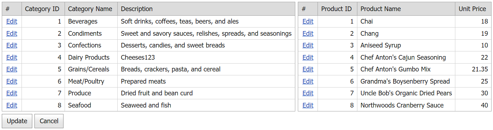

<!-- default badges list -->

[](https://supportcenter.devexpress.com/ticket/details/E4992)
[](https://docs.devexpress.com/GeneralInformation/403183)
<!-- default badges end -->
# Grid View for ASP.NET Web Forms - How to update multiple grid controls on a custom button click
<!-- run online -->
**[[Run Online]](https://codecentral.devexpress.com/e4992/)**
<!-- run online end -->

This example demonstrates how to place multiple grid controls in a callback panel and use a custom button to update the grids simultaneously.



## Overview

Follow the steps below to update multiple grid controls on a custom button click:

1. Create the [Grid View](https://docs.devexpress.com/AspNet/DevExpress.Web.ASPxGridView) controls and wrap them in a callback panel.

    ```aspx
    <dx:ASPxCallbackPanel ID="cp" runat="server" ClientInstanceName="cp" OnCallback="cp_Callback">
        <PanelCollection>
            <dx:PanelContent runat="server" SupportsDisabledAttribute="True">
                <dx:ASPxGridView ID="gv1" runat="server" AutoGenerateColumns="False" DataSourceID="ads1"
                    KeyFieldName="CategoryID" OnCommandButtonInitialize="gv_CommandButtonInitialize">
                    <!-- ... -->
                </dx:ASPxGridView>
                <dx:ASPxGridView ID="gv2" runat="server" AutoGenerateColumns="False" DataSourceID="ads2"
                    KeyFieldName="ProductID" OnCommandButtonInitialize="gv_CommandButtonInitialize">
                    <!-- ... -->
                </dx:ASPxGridView>
            </dx:PanelContent>
        </PanelCollection>
    </dx:ASPxCallbackPanel>
    ```

2. Handle the grid's server-side [CommandButtonInitialize](https://docs.devexpress.com/AspNet/DevExpress.Web.ASPxGridView.CommandButtonInitialize) event. In the handler, hide the grid's default **Update** and **Cancel** command buttons.

    ```csharp
    protected void gv_CommandButtonInitialize(object sender, ASPxGridViewCommandButtonEventArgs e) {
        if (e.ButtonType == ColumnCommandButtonType.Update || e.ButtonType == ColumnCommandButtonType.Cancel)
            e.Visible = false;
    }
    ```

3. Create custom **Update** and **Cancel** buttons and set their `AutoPostBack` property to `false`. In the button's `Click` event handler, call the callback panel's `PerformCallback` method and pass the button type as a parameter.

    ```aspx
    <dx:ASPxButton ID="updateBtn" runat="server" Text="Update" AutoPostBack="false">
        <ClientSideEvents Click="OnUpdateClick" />
    </dx:ASPxButton>
    <dx:ASPxButton ID="cancelBtn" runat="server" Text="Cancel" AutoPostBack="false">
        <ClientSideEvents Click="OnCancelClick" />
    </dx:ASPxButton>
    ```

    ```js
    function OnUpdateClick(s, e) {
        cp.PerformCallback("Update");
    }
    function OnCancelClick(s, e) {
        cp.PerformCallback("Cancel");
    }
    ```

4. Handle the callback panel's server-side `Callback` event. In the handler, call the grid's [UpdateEdit](https://docs.devexpress.com/AspNet/DevExpress.Web.ASPxGridView.UpdateEdit) method to update data or [CancelEdit](https://docs.devexpress.com/AspNet/DevExpress.Web.ASPxGridView.CancelEdit) method to discard changes.

    ```csharp
    protected void cp_Callback(object sender, CallbackEventArgsBase e) {
        switch (e.Parameter) {
            case "Update":
                gv1.UpdateEdit();
                gv2.UpdateEdit();
                break;
            case "Cancel":
                gv1.CancelEdit();
                gv2.CancelEdit();
                break;
        }
    }
    ```

## Files to Review

* [Default.aspx](./CS/WebSite/Default.aspx) (VB: [Default.aspx](./VB/WebSite/Default.aspx))
* [Default.aspx.cs](./CS/WebSite/Default.aspx.cs) (VB: [Default.aspx.vb](./VB/WebSite/Default.aspx.vb))

## Documentation

* [Edit Data in Grid](https://docs.devexpress.com/AspNet/3712/components/grid-view/concepts/edit-data)
